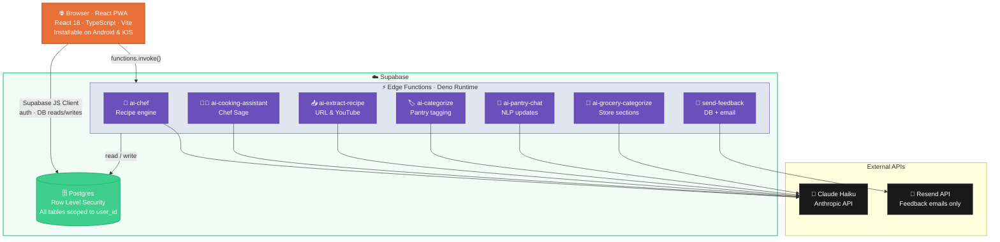

# recipick.ai — Technical Design Document

> Last updated: April 2026
> Author: Vaishnavi Choukwale
> Live: [recipickai.vercel.app](https://recipickai.vercel.app)

---

## Problem

People stand in front of a full fridge and don't know what to cook. Existing recipe apps show aspirational dishes that need 10 ingredients you don't have. Vegetarian and vegan apps exist, but few handle eggitarians, non-vegetarians, or mid-session diet switching cleanly. And recipe variety degrades fast — left unchecked, any AI will suggest the same 5 dishes on repeat.

---

## Product Thinking

The core thesis: **show what you can cook right now, with what you have.**

Everything else follows from that:
- Pantry-first, not recipe-first. The AI never suggests something you're missing half the ingredients for.
- Dietary rules are hard constraints, not suggestions. Vegan means no animal products, ever — including items left over in the pantry from before a diet change.
- Variety is engineered, not hoped for. If the app suggests palak paneer three days in a row, users stop trusting it. The variety engine tracks hero ingredients across sessions and actively steers the AI away from repetition.
- Convenience over perfection. Substitutions for missing ingredients, quick-mode for late nights, voice input everywhere — the app should feel effortless, not like a chore.

Secondary framing (less prominent in UI): recipick.ai also reduces food waste. Surfacing recipes built around what you already have — especially starred or near-expiry items — nudges users toward using existing stock before buying more.

---

## Core Flows

### Recipe Generation

1. User sets optional filters: energy level, cuisine, mood, meal type, equipment, focus ingredient.
2. App calls `ai-chef` edge function with full pantry, filters, dietary profile, and variety data.
3. Claude returns structured JSON with 3 recipe suggestions.
4. `validateAndEnrichRecipes()` runs server-side before anything is returned:
   - Schema validation (required fields, types)
   - Dietary conflict check per recipe
   - `match_percentage` recomputed deterministically against actual pantry
   - `missing_ingredients` recomputed accurately
5. Valid recipes are returned ranked by match %. Recipes that fail validation are dropped silently.
6. If all recipes fail → function returns `validation_error: true` → client retries automatically.
7. User taps a card → full recipe sheet with ingredients, instructions, match breakdown.
8. Missing ingredients can be added to the grocery list in one tap.

### Pantry Management

- Add manually, by voice, or via natural language chat ("I just bought tomatoes and spinach").
- `ai-categorize` runs async on each new item — assigns category and searchable AI tags.
- `ai-pantry-chat` parses freeform intent into structured `{ add, mark_unavailable, remove }` actions.
- Star an ingredient to always build recipes around it. Toggle availability without deleting.

### Chef Sage

- Global AI cooking assistant, accessible from any page via the bottom nav.
- Handles techniques, substitutions, storage, food science, nutrition, equipment.
- Role boundary enforced in the system prompt: recipe requests are redirected to the Home tab. Chef Sage never generates recipe lists.
- Multi-turn — conversation history is passed on each request.

### Recipe Inbox

- User pastes any URL or YouTube link.
- `ai-extract-recipe` fetches the page (or YouTube transcript) and returns a structured recipe.
- Each ingredient is scored against the user's pantry. Save to vault in one tap.

---

## Architecture



The Anthropic API key never reaches the browser. All AI calls are proxied through Supabase Edge Functions. The React client only holds the Supabase anon key, which is safe to expose (RLS enforces user-level access).

### Database

All tables use Row Level Security scoped to `auth.uid() = user_id`.

| Table | Purpose |
|---|---|
| `profiles` | Dietary preference, cooking skill, onboarding state |
| `pantry_items` | User ingredients with category, availability, AI tags, star flag |
| `saved_recipes` | AI-generated and URL-extracted recipes with ratings and tried status |
| `grocery_items` | Shopping list items with store-section categories |
| `feedback` | In-app reactions and messages |

---

## AI Pipeline

### `ai-chef` — Recipe Engine

**Input (key fields):**

```json
{
  "pantry_items": ["tomatoes", "paneer", "..."],
  "dietary_preference": "vegetarian",
  "cooking_skill": "intermediate",
  "day_status": "idle",
  "cuisine_filter": "Indian",
  "mood_filter": "Comfort Food",
  "meal_type_filter": "dinner",
  "equipment_filter": ["oven"],
  "focus_ingredients": ["matki"],
  "region_filter": "Maharashtra",
  "dish_query": "dal",
  "recently_used_ingredients": ["paneer", "chickpeas"],
  "variety_seed": 42,
  "excluded_recipes": ["Palak Paneer"],
  "liked_recipes": ["Misal Pav"],
  "disliked_recipes": ["Dal Makhani"]
}
```

**Output:** 3 structured recipes with `match_percentage`, `missing_ingredients` + substitutions, step-by-step `instructions`, and `why_this` (2–3 practical bullet lines joined by `\n`).

**Key prompt rules:**
- Dietary constraints are hard rules at the top of the prompt — not guidelines.
- Plant-based branded products ("Vegan Chicken", "Beyond Meat", "Tofu") are always safe regardless of dietary mode.
- Masala spice packets ("Fish Curry Masala") are always safe — the meat word is a dish name, not an ingredient.
- `recently_used_ingredients` are excluded from the hero role in any new recipe.
- `variety_seed` 1–25 → grains/legumes, 26–50 → vegetables, 51–75 → dairy, 76–100 → specialty/international pantry items.
- Flavor zone variety: across 3 recipes, must span at least 2 of: comforting/mild, bold/spicy, fresh/light, umami/sweet-savory.
- `missing_ingredients` cannot be empty when `match_percentage < 100`. Water is never listed as missing.

### `ai-cooking-assistant` — Chef Sage

Multi-turn Q&A. System prompt defines role boundary: knowledge only, no recipe lists. Conversation history passed on each call for context continuity.

### `ai-extract-recipe` — Recipe Extraction

Fetches URL content or YouTube transcript, returns structured recipe JSON. Scores each ingredient against the user's current pantry.

### `ai-categorize` — Auto-Categorization

Called async after pantry item creation. Assigns one of 16 categories and up to 5 searchable tags. Item is created immediately (as "other") then updated when classification returns — no blocking UI wait.

### `ai-pantry-chat` — NLP Pantry Updates

Accepts freeform text like "I used up the spinach and bought garlic." Returns `{ add: [], mark_unavailable: [], remove: [] }`. Client executes the actions against the DB.

---

## Data Flow

### Variety Engine (client-side localStorage)

Three values maintained across calls:

| Key | Purpose | Lifetime |
|---|---|---|
| `recently_used_ingredients` | Hero ingredients from last 3 recipe batches (max 12 items) | Accumulates per session; passed to `ai-chef` as exclusion list |
| `variety_seed` | Random 1–100 generated fresh per call | Per-call; steers AI toward a pantry section |
| `excluded_recipes` | Recipe titles from the current session | Session only; prevents duplicates on "Get more ideas" |

Stored in localStorage rather than DB because these are session/device signals — they don't need cross-device sync, and resetting them gracefully degrades variety without breaking anything.

### Recipe Rating Loop

```
User rates 👍/👎 on saved recipe
    ↓
Updates tried_status + is_favorite in saved_recipes table
    ↓
On next ai-chef call, liked_recipes and disliked_recipes
are derived from saved_recipes and sent to the prompt
    ↓
Claude uses them as flavor/style preference signals
(not exact title exclusions — signals, not rules)
```

---

## Tradeoffs

### Server-side AI only
The Anthropic key never reaches the browser. Adds ~50–100ms latency per call vs. direct client requests. Worth it: the alternative exposes the key to any user who opens DevTools.

### Claude Haiku over larger models
Fast enough for mobile (2–5s most calls), cost-effective for a solo project, and instruction-following quality is sufficient for structured JSON output. A tighter prompt with explicit schema compensates for the smaller model's limitations.

### `autoUpdate` PWA registration
Silent background updates with no user friction. A `controllerchange` listener shows a non-blocking toast ("App updated — tap Refresh") when a new service worker activates. Users never get stuck on a stale version without knowing.

### localStorage for variety data
Zero latency, zero DB cost, zero sync complexity. The downside — resets on a new device or cleared storage — is acceptable. If it resets, the AI simply lacks history and picks from a random seed; it doesn't break.

### Inline SVG for mic icons everywhere
Emoji mic (🎙) renders inconsistently across Android/iOS/desktop. SVG gives pixel-perfect, theme-aware rendering across all surfaces: PantryChat, ShopPage, CookingAssistant.

### Dietary conflict handling via prompt, not blocklist
A blocklist is fragile — new product names break it immediately. Instead the prompt uses a three-rule system: (1) dietary mode as absolute constraints, (2) explicit safe-product exceptions (plant-based brands, masala spice packets), (3) "if focus_ingredients violate diet, ignore them — never refuse." This handles edge cases and prevents unhelpful refusals.

### AI-provided `in_pantry` vs deterministic recompute
Claude's `in_pantry` flags on each ingredient are preserved for fuzzy matching — the model can recognise that "cherry tomatoes" matches "tomatoes" in the pantry. However, `match_percentage` and `missing_ingredients` are always recomputed server-side deterministically after the AI responds, so the numbers shown to the user are always accurate regardless of what Claude estimated.

---

## Reliability Improvements (Phase 1)

These changes shipped together to address transient AI failures observed in early user testing.

**`max_tokens` reduction (8192 → 2800):** The model was allocated more output budget than needed for 3 recipes. Reducing the cap forces conciseness and cuts median response time significantly. 2800 tokens is sufficient for 3 fully detailed recipes including instructions.

**Auto-retry on transient errors:** `callAiChef` wraps the edge function call in a helper (`invoke()`). If the first call throws a non-validation error, it waits 2 seconds and retries once before surfacing the error to the user. Validation failures (dietary conflicts in the response) are not retried — they're escalated immediately. This handles Supabase free-tier cold starts without requiring any UI changes.

**Validation layer at the edge:** `validateAndEnrichRecipes()` runs server-side after Claude responds. It checks each recipe against the declared dietary preference before returning. Recipes that fail are dropped silently; if all fail, the function returns `validation_error: true` and the client retries. This prevents dietary violations from ever reaching the UI, even if the model hallucinates.

---

## Future Scope

| Feature | Notes |
|---|---|
| Grocery → pantry | Check off items in grocery list → auto-add to pantry |
| Meal planner | Weekly plan from saved and AI recipes |
| Auto-pantry from grocery | Grocery haul import rebuilds pantry automatically |
| Waste tracker | Flag near-expiry items, surface quick-use recipe ideas |
| Shareable recipe cards | Export recipe as image for social sharing |
| Community vault | Discover recipes saved and loved by other users |
| Push notifications | "You have 3 starred ingredients — want a recipe idea?" |
| Nutrition estimates | Macro breakdown per recipe from Claude |
