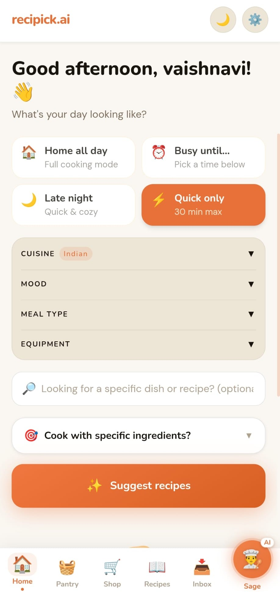
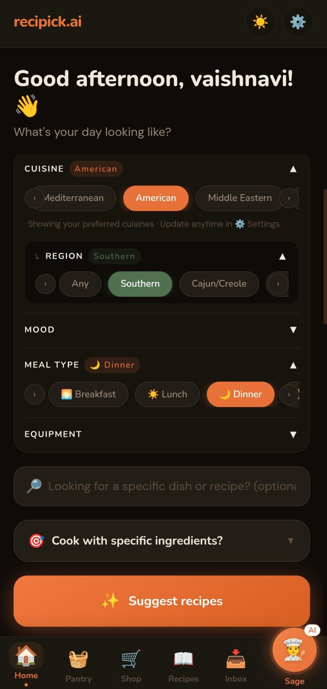
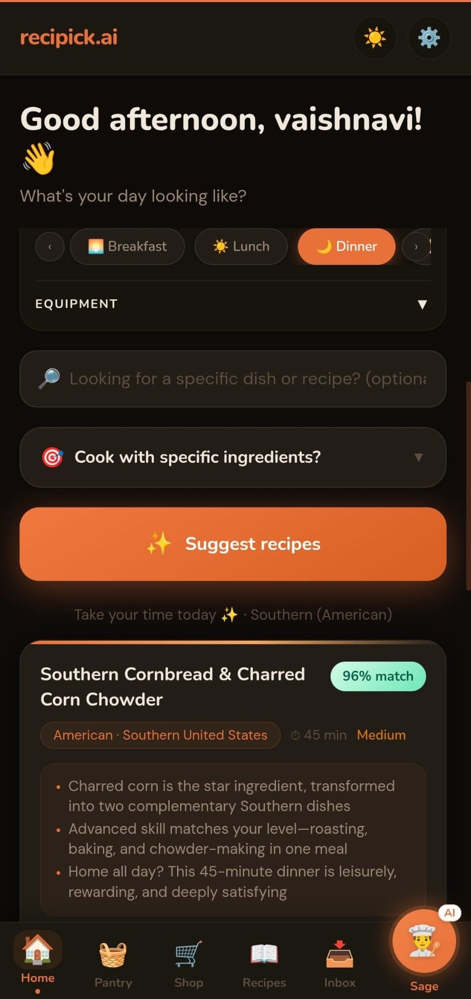
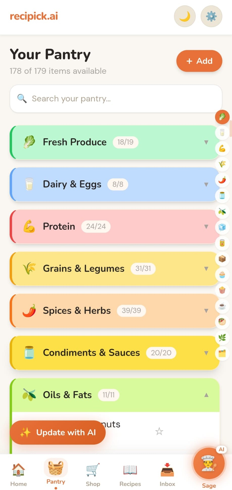
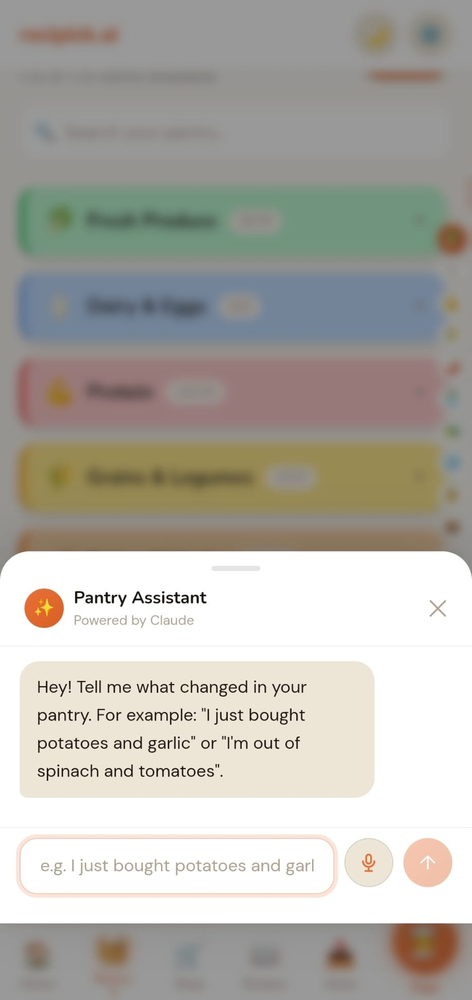
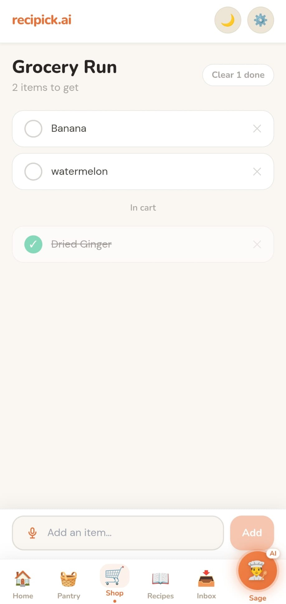
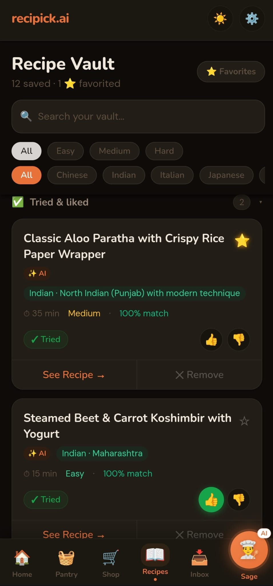
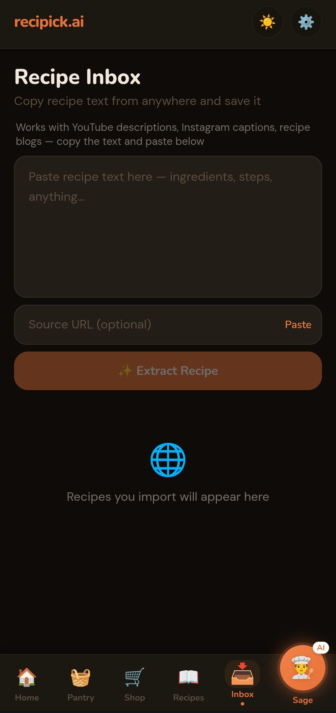
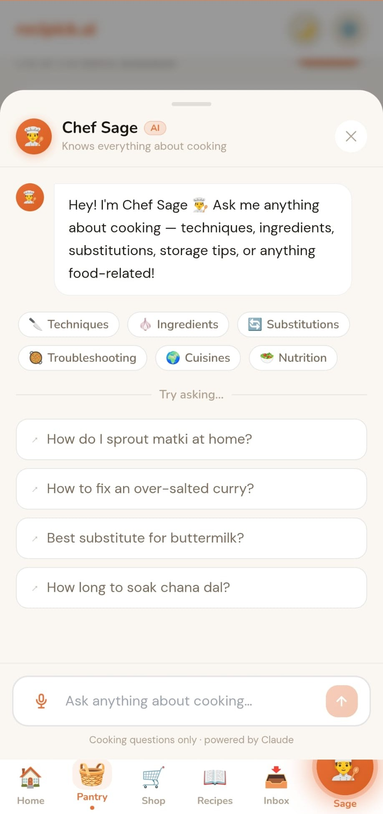

<div align="center">

# recipick.ai

**Pantry-first AI recipe companion — personalised to what you have, how you eat, and how much energy you have today**

[](https://recipickai.vercel.app)
[](https://recipickai.vercel.app)
[](https://anthropic.com)
[](https://supabase.com)
[](https://react.dev)
[](https://typescriptlang.org)
[](LICENSE)

🔗 **Live App:** [recipickai.vercel.app](https://recipickai.vercel.app/)

</div>

---

## Overview

recipick.ai works backwards from your pantry. Instead of showing aspirational recipes that need 10 ingredients you don't have, it looks at what's already in your kitchen and suggests what you can cook right now — matched to your dietary profile, energy level, cuisine preferences, and taste history.

It supports four dietary profiles — **vegan**, **vegetarian**, **eggitarian (lacto-ovo)**, and **non-vegetarian** — with precise AI conflict detection that handles edge cases like plant-based mock meats and masala spice packets correctly.

Built as a **Progressive Web App**, it installs directly from the browser on Android and iOS — no App Store required.

---

## Why I Built This

I built recipick.ai from a real daily problem: deciding what to cook with whatever was already in my kitchen.

Most recipe apps assume users start with a dish in mind. In reality, many people start with a pantry, limited time, dietary preferences, and the question: "What can I make today?"

recipick.ai started as a simple pantry-based recipe idea and grew into a full product with AI generation, recipe validation, pantry management, grocery planning, and saved recipe feedback.

---

## Features

| Feature | Description |
|---|---|
| 🤖 **AI Chef** | Set energy level, cuisine, mood, meal type, and equipment. Get 3 recipes ranked by pantry match %, with substitutions for anything missing. |
| 🧺 **Smart Pantry** | Add ingredients across 16 categories. AI auto-categorises on add. Star items to always cook around them. |
| 🌍 **Regional Cuisine** | Go beyond "Indian" or "Chinese" — ask for Maharashtrian, Sichuan, Oaxacan. The AI knows authentic regional dishes. |
| 🎯 **Focus Mode** | Select one or more pantry items and every recipe is built around them as the hero ingredient. |
| 🔀 **Variety Engine** | Tracks hero ingredients across sessions and uses a variety seed to steer the AI toward a fresh pantry section each call. |
| 🧑‍🍳 **Chef Sage** | AI cooking assistant on every page — techniques, substitutions, storage, food science. Voice + text. Multi-turn. |
| 📥 **Recipe Inbox** | Paste any URL or YouTube link. AI extracts ingredients, scores against your pantry, and saves in one tap. |
| 📖 **Recipe Vault** | Saved recipes in collapsible sections: Not tried / Liked / Didn't enjoy. Filter by cuisine, difficulty, favourites. |
| ⭐ **Favorites** | Star to bookmark. Rate 👍/👎 after cooking. Ratings feed back into AI for better future suggestions. |
| 🛒 **Grocery List** | Missing ingredients go to your grocery list in one tap. Voice input. Check off as you shop. |
| ⚙️ **Diet & Profile** | Vegan, vegetarian, eggitarian, or non-vegetarian. Conflict detection on diet change. |
| 📲 **PWA** | Install from the browser on any device. Auto-updates silently in the background. |
| 🌙 **Dark Mode** | Full dark theme with persistent preference per device. |
| 💬 **In-App Feedback** | One-tap reaction + message form in Settings. Responses go directly to the developer. |

---

## Screenshots

### 🏠 Home Page

<table>
  <tr>
    <td align="center"></td>
    <td align="center"></td>
    <td align="center"></td>
  </tr>
  <tr>
    <td align="center">Light theme</td>
    <td align="center">Filters & cuisine</td>
    <td align="center">Recipe results</td>
  </tr>
</table>

### 🧺 Pantry

<table>
  <tr>
    <td align="center"></td>
    <td align="center"></td>
  </tr>
  <tr>
    <td align="center">Pantry overview</td>
    <td align="center">Pantry Assistant (AI)</td>
  </tr>
</table>

### 🛒 Grocery List &nbsp;&nbsp; 📖 Recipe Vault &nbsp;&nbsp; 📥 Recipe Inbox

<table>
  <tr>
    <td align="center"></td>
    <td align="center"></td>
    <td align="center"></td>
  </tr>
  <tr>
    <td align="center">Grocery Run</td>
    <td align="center">Recipe Vault</td>
    <td align="center">Recipe Inbox</td>
  </tr>
</table>

### 🧑‍🍳 Chef Sage

<table>
  <tr>
    <td align="center"></td>
  </tr>
  <tr>
    <td align="center">AI cooking assistant — available on every page</td>
  </tr>
</table>

---

## How It Works

1. **Add pantry ingredients** and set your dietary preference.
2. **Select filters** — cuisine, meal type, mood, equipment, or focus ingredients. All optional.
3. **The request is sent** to a Supabase Edge Function with your full pantry, profile, and variety data.
4. **Claude generates** 3 structured recipe suggestions as JSON.
5. **The response is validated** before anything is shown:
   - Schema validation (required fields, types)
   - Dietary conflict check per recipe
   - Match % recomputed deterministically against your actual pantry
   - Missing ingredients recomputed accurately
6. **Valid recipes are displayed**, ranked by pantry match %. Recipes that fail validation are dropped silently.
7. **Save, cook, or shop** — save to your vault, follow step-by-step instructions, or add missing items to your grocery list in one tap. Rate after cooking to improve future suggestions.

---

## Architecture

```
Browser (React PWA)
    ↓
Supabase JS Client
    ↓
Supabase Postgres (RLS)   ←→   Supabase Edge Functions (Deno)
                                        ↓
                               Anthropic Claude Haiku API
                                        ↓
                               (send-feedback only) Resend API
```

All AI calls are server-side via Supabase Edge Functions. The Anthropic API key never reaches the browser.

### Edge Functions

| Function | Purpose |
|---|---|
| `ai-chef` | Core recipe engine — pantry matching, dietary rules, variety logic |
| `ai-cooking-assistant` | Chef Sage chatbot — multi-turn cooking Q&A |
| `ai-extract-recipe` | Extracts structured recipe from any URL or YouTube link |
| `ai-categorize` | Auto-assigns pantry items to 16 categories with AI tags |
| `ai-pantry-chat` | Natural language pantry updates ("used up the milk") |
| `ai-grocery-categorize` | Assigns store-section categories to grocery items |
| `send-feedback` | Saves feedback to DB and emails developer via Resend |

---

## Tech Stack

| Layer | Technology |
|---|---|
| Frontend | React 18, TypeScript 5, Vite 5, Tailwind CSS v3 |
| Auth & Database | Supabase (Postgres + RLS + Google OAuth) |
| AI | Anthropic Claude Haiku (`claude-haiku-4-5-20251001`) |
| Edge Functions | Supabase Edge Functions (Deno runtime) |
| PWA | vite-plugin-pwa, Service Worker, standalone mode |
| Deployment | Vercel — auto-deploy on push to `main` |

---

## Setup Instructions

### Prerequisites

- Node.js 18+
- A [Supabase](https://supabase.com) project (free tier works)
- An [Anthropic API key](https://console.anthropic.com)

### 1. Clone and install

```bash
git clone https://github.com/VChoukwale/recipick-ai.git
cd recipick-ai
npm install
```

### 2. Environment variables

Create `.env.local` in the root:

```env
VITE_SUPABASE_URL=https://your-project-ref.supabase.co
VITE_SUPABASE_ANON_KEY=your-supabase-anon-key
```

Both values are in **Supabase Dashboard → Project Settings → Data API**.

### 3. Database migrations

Run in order in your **Supabase SQL Editor**:

```
supabase/migrations/001_initial_schema.sql
supabase/migrations/002_supplements_category.sql
supabase/migrations/003_recipe_inbox.sql
supabase/migrations/004_grocery_list.sql
supabase/migrations/005_feedback.sql
```

### 4. Google OAuth

Supabase Dashboard → Authentication → Providers → Google. Enable it, add OAuth credentials, and add `http://localhost:5173` to allowed redirect URLs.

### 5. Edge Functions

Add your Anthropic key in **Supabase Dashboard → Edge Functions → Secrets** as `ANTHROPIC_API_KEY`.

Deploy all functions:

```bash
export SUPABASE_ACCESS_TOKEN=your-access-token
export PROJECT_REF=your-project-ref

npx supabase functions deploy ai-chef --project-ref $PROJECT_REF --no-verify-jwt
npx supabase functions deploy ai-cooking-assistant --project-ref $PROJECT_REF --no-verify-jwt
npx supabase functions deploy ai-categorize --project-ref $PROJECT_REF --no-verify-jwt
npx supabase functions deploy ai-extract-recipe --project-ref $PROJECT_REF --no-verify-jwt
npx supabase functions deploy ai-pantry-chat --project-ref $PROJECT_REF --no-verify-jwt
npx supabase functions deploy ai-grocery-categorize --project-ref $PROJECT_REF --no-verify-jwt
npx supabase functions deploy send-feedback --project-ref $PROJECT_REF --no-verify-jwt
```

Add `RESEND_API_KEY` as an additional secret for the feedback email feature.

Get your personal access token from [supabase.com/dashboard/account/tokens](https://supabase.com/dashboard/account/tokens). Never commit it.

### 6. Run

```bash
npm run dev
```

Open [http://localhost:5173](http://localhost:5173)

### Deploying to Vercel

1. Connect the repo at [vercel.com](https://vercel.com). Vite is auto-detected.
2. Add `VITE_SUPABASE_URL` and `VITE_SUPABASE_ANON_KEY` as environment variables.
3. After first deploy, add your Vercel URL to **Supabase → Authentication → URL Configuration → Redirect URLs**.

Every push to `main` triggers an automatic redeploy.

---

## Usage

### Generating recipes

- Open the Home tab.
- Optionally set filters: cuisine, mood, meal type, equipment, or energy level.
- Tap **Cook for me** to get 3 personalised recipes.
- Tap a recipe card to see full ingredients, pantry match breakdown, and step-by-step instructions.
- Tap **Add missing to grocery** or **Save recipe** directly from the detail sheet.

### Pantry management

- Go to the Pantry tab.
- Add items manually, by voice, or by typing natural language in the chat bar ("I just bought spinach and lentils").
- Star an ingredient to always build recipes around it.
- Toggle availability (in stock / out of stock) without deleting.

### Chef Sage

- Tap the orange button in the bottom nav (any page).
- Ask anything cooking-related: techniques, ingredient substitutions, storage, food science.
- Chef Sage will redirect recipe requests to the Home tab — it's a knowledge assistant, not a recipe generator.

---

## Known Limitations

| Limitation | Detail |
|---|---|
| Recipe count | 3 per request — requesting 5 causes timeouts on Supabase free tier |
| Voice input | Web Speech API — Chrome on Android/desktop only; not supported on iOS Safari |
| Variety engine | Stored in localStorage — resets if cleared or on a new device |
| Pantry size | No hard limit, but very large pantries (100+ items) may reduce recipe relevance |
| Offline | PWA caches the app shell and static assets; AI features require a network connection |
| AI response time | 2–5 seconds typical; occasional cold starts on Supabase free tier may be slower |

---

## Roadmap

- **Grocery → pantry** — check off items in grocery list and auto-add them to pantry
- **Meal planner** — plan breakfast/lunch/dinner for the week from saved and AI recipes
- **Auto-pantry from grocery** — importing a grocery haul rebuilds pantry automatically
- **Waste reduction tracker** — flag items nearing expiry, surface quick-use recipe ideas
- **Shareable recipe cards** — export a recipe as an image for social sharing
- **Community vault** — discover recipes saved and loved by other users

---

## Project Structure

```
src/
├── components/
│   ├── home/          # RecipeCard, RecipeDetailSheet, DayStatusPicker
│   ├── layout/        # AppShell, BottomNav
│   ├── pantry/        # PantrySection, PantryItemRow, AddItemSheet, PantryChat
│   └── ui/            # CookingAssistant (Chef Sage), CookingSpinner, SettingsSheet
├── contexts/          # AuthContext, CookingAssistantContext
├── hooks/             # useTheme
├── lib/               # Supabase client
├── pages/             # HomePage, PantryPage, ShopPage, RecipesPage, InboxPage, AuthPage, OnboardingPage
└── types/             # TypeScript database types

supabase/
├── functions/
│   ├── ai-chef/                # Recipe recommendation engine
│   ├── ai-cooking-assistant/   # Chef Sage chatbot
│   ├── ai-categorize/          # Auto-categorizes pantry items
│   ├── ai-extract-recipe/      # Extracts recipe from URL / YouTube
│   ├── ai-pantry-chat/         # Natural language pantry updates
│   ├── ai-grocery-categorize/  # Grocery list categorization
│   └── send-feedback/          # In-app feedback → DB + email
└── migrations/
    ├── 001_initial_schema.sql
    ├── 002_supplements_category.sql
    ├── 003_recipe_inbox.sql
    ├── 004_grocery_list.sql
    └── 005_feedback.sql
```

---

## License

MIT
